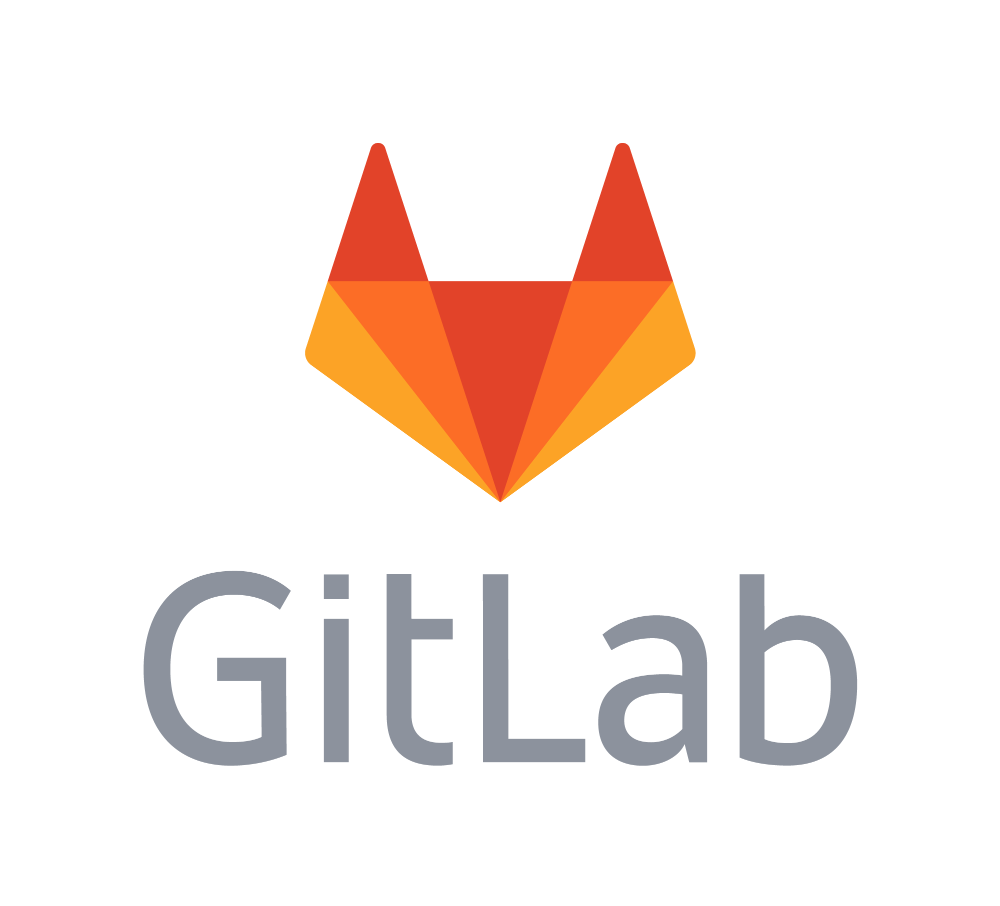

<!--About me-->
## :information_desk_person:About me

- My name is Dmitry, I'm 28 years old.
- I'm automation engineer from Kazan.
- I working QA: 
<a href="https://newround.ru/" rel="nofollow">'Round'</a>

- I write autotests in Python
- Сontact with me:

  
  
  

<a href="https://disk.yandex.ru/d/nKq-WIc1vc9zjA" rel="nofollow">Certificates and personal achievements</a>

<a href="https://youtu.be/vkLsx47lQ0g?si=WnZ0lZpWQSRZZ2bv" rel="nofollow">My interview for</a> <a href="https://round.zone/" rel="nofollow">ROUND</a>

<!--Git Stats-->

&#8287;&#8287;&#8287;&#8287;&#8287;

## :bar_chart:Git stats

<!--Stack and tools-->

&#8287;&#8287;&#8287;&#8287;&#8287;

## :briefcase: Technologies

  <code></code>
  <code></code>
  <code></code>
  <code></code>
  <code></code>
  <code></code>
  <code></code>
  <code></code>
  <code></code>
  <code></code>
  <code></code>
  <code></code>
  <code></code>
  <code></code>
  <code></code>
  <code></code>
  <code></code>
  <code></code>
  <code></code>
  <code></code>
  <code></code>
  <code></code>
  <code></code>

## :man_student:Education

<table width="100%" border='0'>
   <tr> 
    <td width="30%" valign="bottom"></td><td valign="middle">Kazan Federal University, Department of Innovation and Investment, Direction - Business Analytics.</td></tr>
  </table>
   

#### Additional Education:

<table width="100%" border='0'>
    <tr><td width="30%" valign="bottom"></td><td valign="middle">School of Test Manual Engineers <a target="_blank" href="https://vk.com/qakrotov">QA.Krotov</a>.</td></tr>
    <tr><td width="30%" valign="bottom"></td><td valign="middle">School of Test Automation Engineers <a target="_blank" href="https://qa.guru">QA.Guru</a>.</td></tr>
   </tr>
  </table>

<!--Projects-->

<!--
**DmanYV/DmanYV** is a ✨ _special_ ✨ repository because its `README.md` (this file) appears on your GitHub profile.

Here are some ideas to get you started:

- 🔭 I’m currently working on ...
- 🌱 I’m currently learning ...
- 👯 I’m looking to collaborate on ...
- 🤔 I’m looking for help with ...
- 💬 Ask me about ...
- 📫 How to reach me: ...
- 😄 Pronouns: ...
- ⚡ Fun fact: ...
-->
